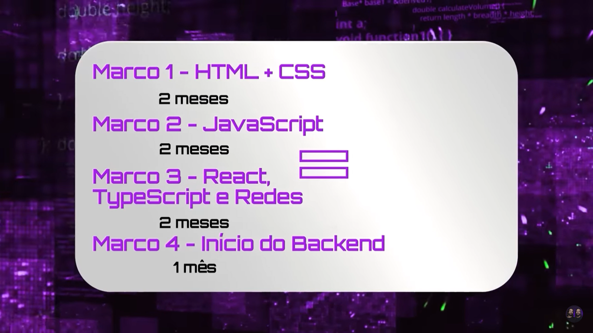

# 03/07/23 - Nível 1 As maiores recompensas da área de programação

Vamos passar informações importantes.

É possível ser programador com 7 meses de curso e colocando a mão em prática do zero absoluto com a abordagem dos gemeos.

*Você não precisa de nenhum dom especial para ser programador. São pessoas comuns que tem as suas dificuldades e nem eu, mas não mediram esforços para conseguir mudar de vida com programação. Você precisa de foco, raça e determinação.*

Great Places to Work -> Pesquisar

As vezes dá raiva ao estudar programação, porque a síndrome do impostor pode falar mais alto. 
"Que mer*& é isso aqui? Não estou conseguindo entender. Será que sou um bom programador?"

Ficar bom desde cedo nas tecnologias que o mercado precisa.

## As maiores recompensas da área de programação

1. Trabalhar sem faculdade: 
- Não é igual direito, medicina... Essa é a maior vantagem de iniciar na programação. 
- Aprende a base da programação e começa a construir projetos. 

2. Ver resultado rápido: 
- Em alguns meses você pode começar a fazer projetos ou até mesmo um freela ou até ser contratado por uma empresa.

- Em 7 meses de estudo é o mínimo para aprender a base de programação.

3. Trabalhar mesmo sem experiência:
- Fazer bons projetos garante sua vaga de emprego. Landing Page, website ou qualquer projeto que demostra que você tem as habilidades certas.

4. Trabalhar remotamente de qualquer lugar para qualquer empresa:
- Já pensou receber em Dolar e trabalhar em casa?

5. Ganhar bem e ganhar melhor ainda.

6. Trabalhar para empresas gringas
- Trabalhar para empresas fora do país
- É necessário ter conhecimento em inglês
- Exigem um pouco mais de experiência do que aqui no Brasil

# 04/07/23 LIVE DO PROJETO 1 - HTML: A BASE DO FRONTEND - INICIANDO O PROJETO

O que é HTML ? -> https://developer.mozilla.org/pt-BR/docs/Web/HTML

*Deixar seu código organizado.*
*Pesquise sobre nomenclatura de pasta*
*Pesquise sobre semântica*

# Nível 2 - O atalho do mapa - Primeira vaga em 7 meses - https://devemdobro.com/wp-content/uploads/2023/06/PDF-AULA-2.pdf

Você precisa de um bom plano para aprender programação. Desenvolvimento web é uma dica de ouro para começar.

Pesquisar a diferença entre Front-End e Back-End: 

Exigência nas empresas de programação sobre conhecimento é bom, pois você vai estar comprometido a aprender programação. Mas calma! Você precisa aprender o básico primeiro. E você precisa se comprometer nos estudos da programação.

## Marcos de aprendizado

1. Aprender a base do HTML e CSS. Em dentro de 2 meses você consegue fazer isso. Depois de aprender, utilizar o Front-End mentor para praticar as habilidades.

2. Aprender JavaScript. Em dentro de 2 meses você consegue aprender.

O foco é aprender a base necessária para aplicar em projetos.

E quando aprender JS vai reforçar os conhecimentos em HTML e CSS para melhorar o seu CV.

3. React + TypeScript. Em dentro de 2 meses você consegue fazer isso. 

Já com HTML e CSS e um pouco de JS, você pode começar a criar a sua marca pessoal.
Vai criar o seu portfólio e vai atualizar o seu linkedin.
Atualize as suas redes de acordo com a sua evolução.

As redes: Currículo, portfólio, Linkedin e Github

Quando chegar nessa parte, vai ser a melhor hora de procurar empregos de programação.

## Imagens de estudos. 7 meses:

Aprender código é muito importante, mas não é só isso. Tem outros fatores. Mas quais são eles?
Hard skills e soft skills..? Pesquisar.

# LIVE DO PROJETO 2 - ESTILIZANDO COM CSS - COMPLETANDO A ESTRUTURA DO PROJETO

O que é CSS? -> https://developer.mozilla.org/pt-BR/docs/Web/CSS

# Nível 3 - Não comece sem ele: te damos O MapaDev

*O nível mais importante de todos, porque iremos percorrer juntos o MapaDev*

## 1. O plano implacável.

Você pode aprender programação. Acredite no seu potencial.

O desenvolvimento web Front-End é o melhor caminho para aprender programação. Mais tarde você aprende conceitos de Back-End

Tenha 3 itens no inventário: HTML, CSS e JS.

Ser programador full-stack é bem gostoso e poderoso. Mas calma!!! Primeiro foca no Front e depooois vai para o Back.

O seu objetivo é estudar a base do Front-End e depois se aprofundar. O foco agora não saber 100%.

## 2. Colocando em prática

*É a parte mais legal de todas!*

Dica de profissional: Se exponha sempre a conteúdos sobre programação! 
Busque formas de entrar em contato com a área relacionada que você quer aprender.

Alguns exemplos: Podcast Dev em Dobro, Quebra Dev, RebuildCast, Lambda3 Podcast

Sempre esteja buscando novas formas de aprender e sempre esteja disposto a aprender.

Participe de comunidades. Tire suas dúvidas sem ter medo.

Você consegue sim estudar sozinho, mas vai ser mais demorado e difícil.

Comprar cursos é um investimento. E não um gasto.

Tempo é dinheiro. Invista em um curso.

Não é só se divertir, mas também investir na carreira de programação.

Você não precisa de experiências trabalhando dentro de empresas de tecnologia. Mas você pode construir e ter experiências em projetos pessoais.

FrontEndMentor é uma melhores práticas para ter projetos pessoais no portfólio.

*Programar é só o 50% do caminho. Os outros 50% é saber se vender.*

Você precisa provar para os recrutadores que você sabe da bases das tecnologias e o github vai ser um grande aliado nisso.

## 3. Marketing Pessoal

*É esse ponto que vai te ajudar a conseguir o teu primeiro emprego.*

Prepare as tuas redes e o teu currículo o quanto antes. 

Site GPTW

Essa é a hora de aplicar para as vagas. Não é só duas vagas é para 10, 20, 30, 50 vagas. Sem desânimo!

Você pode mudar a sua vida com programação. Mas precisa percorrer o caminho, ter foco e ânimo.

# 08/07/23 - LIVE DO PROJETO 3 - A MAGIA DO JAVASCRIPT - FINALIZANDO O PROJETO E ADICIONANDO AO GITHUB

O que é JavaScript? -> https://developer.mozilla.org/pt-BR/docs/Web/JavaScript/Guide

Nâo faça muitos comentários do seu código. Seja ele HTML CSS ou JS.

